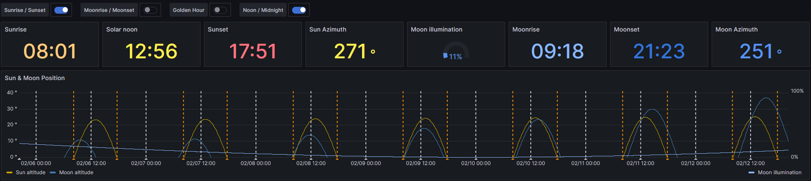
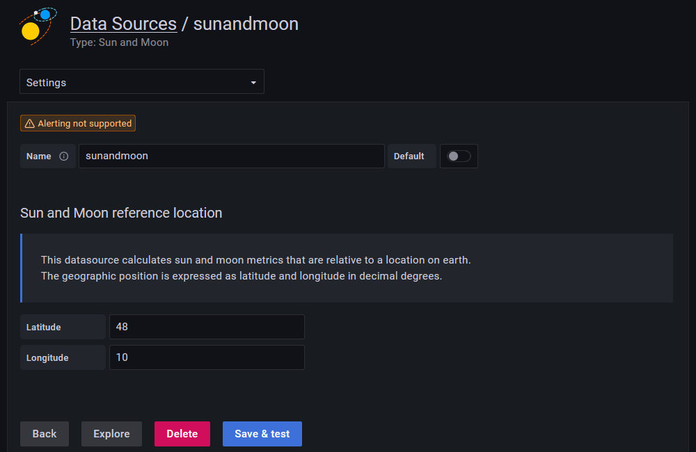

# Sun and Moon Datasource Plugin for Grafana

SunAndMoon is a Datasource Plugin for [Grafana](https://grafana.org) that
calculates the position of Sun and Moon as well as the Moon illumination using
[SunCalc](https://github.com/mourner/suncalc).

Additionally it provides annotations for sunrise, sunset, twilight,
moonrise, moonset and others.

## Configuration

All values are location dependent, the reference location needs to be
configured in the datasource settings.

## License

This projected is licensed under the terms of the MIT license.
